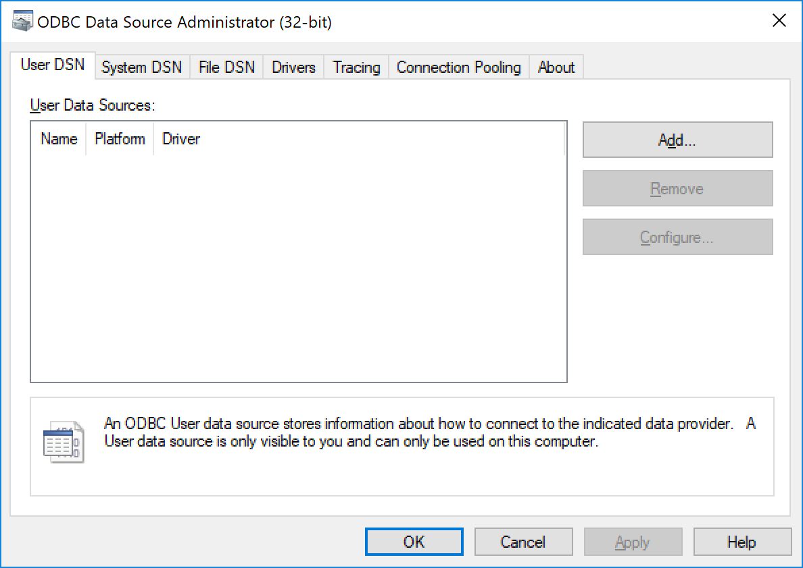

# ODBC Configuration

On Windows you can open the ODBC administration panel either by running *odbcad32.exe* from the start menu or command line.

If you want to open it directly from Pharo use

```Smalltalk
LibC system: 'odbcad32'
```
which should then display the following window:




## Drivers 

If you click on the drivers tab you will see a list of all available drivers.

Within Pharo you can access the drivers using the following method:

```Smalltalk
ODBCSQLEnvironment allDrivers
```

The returned drivers collection includes instances of class *ODBCDriver**


